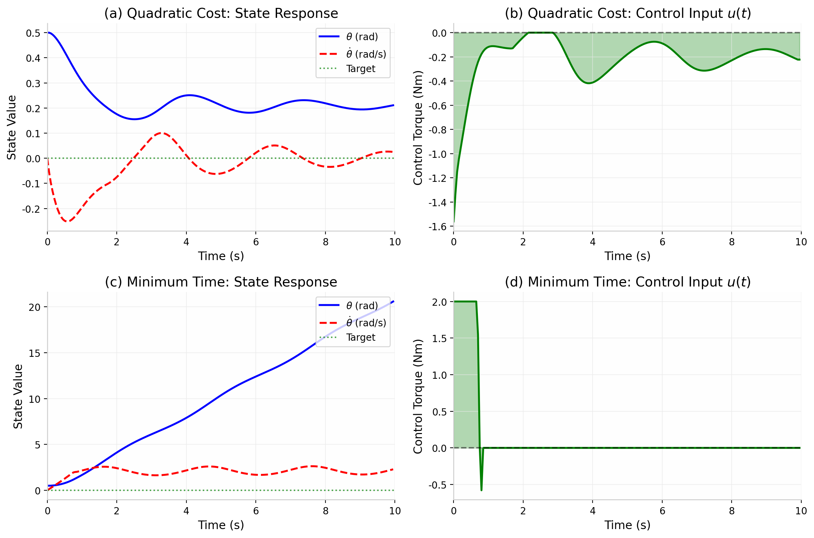
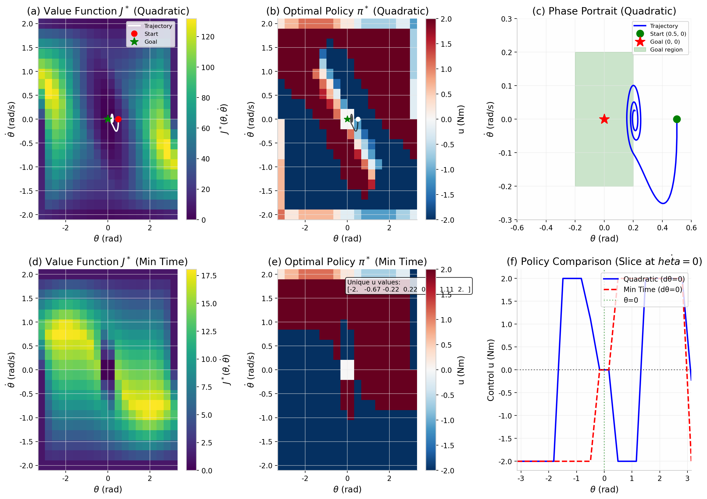
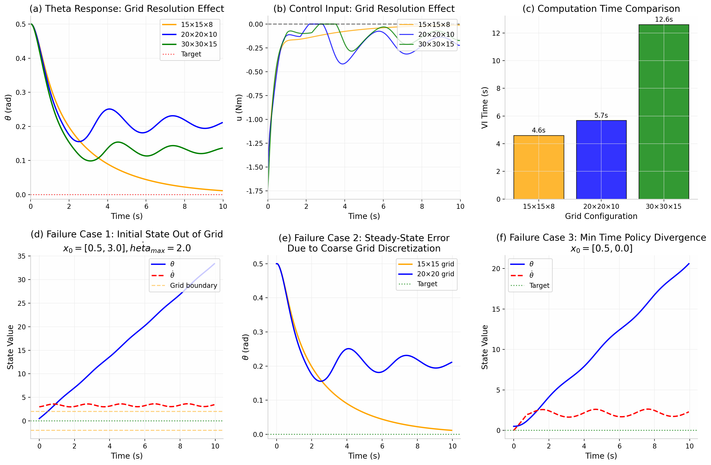

# 课程设计报告

**项目名称**：Project 2: 基于价值迭代的倒立摆全局最优控制 (Value Iteration for Pendulum)

**学生姓名**：刘明峰
**学号**：2024312413
**完成日期**：2026年5月27日

---

## 摘要

本项目针对简单倒立摆（Simple Inverted Pendulum）系统，采用动态规划中的**价值迭代（Value Iteration）**算法求解全局最优反馈控制策略。首先通过拉格朗日方程建立系统动力学模型，并将连续状态空间 $[\theta, \dot{\theta}]$ 和控制输入空间 $[u]$ 进行网格离散化。在离散网格上实现了 Value Iteration 算法，计算最优代价函数 $J^*(\theta, \dot{\theta})$，并提取最优反馈策略 $\pi^*(\theta, \dot{\theta})$。对比了两种成本函数——**Quadratic Cost**（产生平滑控制）和 **Minimum Time Cost**（产生 Bang-bang 开关控制）——下的策略差异。通过消融实验分析了网格分辨率对计算精度和收敛性的影响，并分析了典型失败案例。仿真结果表明，价值迭代能够为非线性倒立摆系统提供全局最优的反馈控制策略，验证了动态规划在非线性最优控制中的有效性。

**关键词**：欠驱动系统、动态规划、价值迭代、最优控制、离散化、Bang-bang 控制

---

## 1. 引言

### 1.1 项目背景与意义

倒立摆（Inverted Pendulum）是控制理论中最经典的欠驱动系统之一，其控制问题涵盖了非线性动力学、稳定性分析、最优控制等多个核心领域。由于系统只有在竖直向上的不稳定平衡点处才能保持平衡，且控制输入维度小于自由度维度（1个力矩控制2个状态），使得该问题具有显著的挑战性。

传统的线性控制器（如 LQR）只能在平衡点附近的小范围内保证稳定性，对于大角度偏离（如从下垂位置摆起）则无法适用。动态规划（Dynamic Programming, DP）通过在整个状态空间上求解 Hamilton-Jacobi-Bellman (HJB) 方程，能够为非线性系统提供**全局最优**的反馈控制策略。

### 1.2 相关研究现状

动态规划由 Bellman 提出，是解决多阶段决策问题的经典方法。对于连续系统的最优控制，HJB 方程提供了必要条件，但解析求解通常不可行。值迭代通过离散化状态空间，将连续问题转化为离散马尔可夫决策过程（MDP），利用贝尔曼最优性原理迭代求解。

MIT 的 Underactuated Robotics 课程（Russ Tedrake）系统介绍了基于 Drake 的机器人动力学与控制方法，其中价值迭代是求解非线性最优控制的核心工具之一。与 LQR 相比，价值迭代不依赖于线性化假设，适用范围更广。

### 1.3 本报告结构安排

本报告第2节建立倒立摆的动力学模型并进行拉格朗日推导；第3节介绍价值迭代算法的原理与实现；第4节描述仿真实现细节；第5节展示实验结果、消融实验与失败案例分析；第6节总结结论与展望。

---

## 2. 系统建模与动力学推导

### 2.1 系统描述

考虑一个绕固定支点旋转的简单倒立摆，如图2-1所示。摆杆质量为 $m$，长度为 $l$，转动惯量为 $I = ml^2$。控制输入为施加在支点处的力矩 $u$。以竖直向上为 $	heta = 0$，逆时针方向为正。

**表 2-1 系统物理参数**

| 参数 | 符号 | 数值 | 单位 | 选取依据 |
|------|------|------|------|----------|
| 质量 | $m$ | 1.0 | kg | 归一化方便计算 |
| 杆长 | $l$ | 1.0 | m | 归一化方便计算 |
| 重力加速度 | $g$ | 9.81 | m/s² | 标准值 |
| 转动惯量 | $I$ | 1.0 | kg·m² | $I = ml^2$ |
| 控制上限 | $u_{max}$ | 2.0 | Nm | 执行器饱和约束 |
| 状态范围 | $	heta$ | $[-\pi, \pi]$ | rad | 覆盖全圆周 |
| 角速度范围 | $\dot{\theta}$ | $[-2, 2]$ | rad/s | 合理动力学范围 |

### 2.2 拉格朗日建模

**动能**：
$$T = \frac{1}{2} I \dot{\theta}^2 = \frac{1}{2} ml^2 \dot{\theta}^2$$

**势能**（以支点水平面为参考，向上为正）：
$$V = mgl \cos\theta$$

**拉格朗日量**：
$$\mathcal{L} = T - V = \frac{1}{2} ml^2 \dot{\theta}^2 - mgl \cos\theta$$

**欧拉-拉格朗日方程**：
$$\frac{d}{dt}\left(\frac{\partial \mathcal{L}}{\partial \dot{\theta}}\right) - \frac{\partial \mathcal{L}}{\partial \theta} = u$$

计算各项：
$$\frac{\partial \mathcal{L}}{\partial \dot{\theta}} = ml^2 \dot{\theta}, \quad \frac{d}{dt}\left(\frac{\partial \mathcal{L}}{\partial \dot{\theta}}\right) = ml^2 \ddot{\theta}$$

$$\frac{\partial \mathcal{L}}{\partial \theta} = mgl \sin\theta$$

代入得：
$$ml^2 \ddot{\theta} + mgl \sin\theta = u$$

$$\ddot{\theta} = -\frac{g}{l} \sin\theta + \frac{u}{ml^2}$$

**归一化形式**（令 $g/l = 1$，$1/(ml^2) = 1$）：
$$\ddot{\theta} = \sin\theta + u$$

> **注意**：此处 $	heta = 0$ 为竖直向上（不稳定平衡点）。当 $\theta$ 很小时，$\sin\theta \approx \theta$，线性化为 $\ddot{\theta} = \theta + u$，与标准倒立摆线性模型一致。

**状态空间形式**：
设状态向量 $\mathbf{x} = [\theta, \dot{\theta}]^T$，则：

$$\dot{\mathbf{x}} = \mathbf{f}(\mathbf{x}, u) = \begin{bmatrix} \dot{\theta} \\ \sin\theta + u \end{bmatrix}$$

---

## 3. 控制器 / 算法设计

### 3.1 价值迭代（Value Iteration）设计原理

价值迭代是动态规划求解最优控制问题的核心算法，基于**贝尔曼最优性原理**：

$$J^*(\mathbf{s}) = \min_{u} \left[ L(\mathbf{s}, u) + \gamma J^*(\mathbf{s}') \right]$$

其中：
- $J^*(\mathbf{s})$：最优代价函数（价值函数）
- $L(\mathbf{s}, u)$：即时成本
- $\gamma$：折扣因子
- $\mathbf{s}'$：执行控制 $u$ 后的下一状态

**算法流程**：
1. 离散化状态空间 $\mathcal{S}$ 和控制空间 $\mathcal{U}$
2. 初始化 $J_0(\mathbf{s}) = 0$
3. 迭代更新：$J_{k+1}(\mathbf{s}) = \min_{u} \left[ L(\mathbf{s}, u) + \gamma J_k(\mathbf{s}') \right]$
4. 直到 $\|J_{k+1} - J_k\|_\infty < \epsilon$ 收敛
5. 提取最优策略：$\pi^*(\mathbf{s}) = \arg\min_{u} Q(\mathbf{s}, u)$

### 3.2 关键公式推导

**状态转移**（欧拉积分）：
$$\mathbf{s}' = \mathbf{s} + \mathbf{f}(\mathbf{s}, u) \cdot \Delta t$$

即：
$$\theta' = \theta + \dot{\theta} \Delta t$$
$$\dot{\theta}' = \dot{\theta} + (\sin\theta + u) \Delta t$$

**成本函数设计**：

1. **Quadratic Cost**（LQR风格）：
   $$L(\mathbf{s}, u) = \theta^2 + \dot{\theta}^2 + 0.1 u^2$$
   特点：惩罚状态偏差和控制能量，产生**平滑连续**的控制策略。

2. **Minimum Time Cost**：
   $$L(\mathbf{s}, u) = \begin{cases} 0, & \text{if } \mathbf{s} \in \text{Goal} \\ 1, & \text{otherwise} \end{cases}$$
   特点：每步固定代价，目标是最快到达目标区域，产生 **Bang-bang 开关控制**。

### 3.3 参数整定依据

| 参数 | 数值 | 选取依据 |
|------|------|----------|
| 离散时间步长 $\Delta t$ | 0.05 s | 兼顾精度与计算效率 |
| 折扣因子 $\gamma$ | 0.99 | 保证收敛，平衡远期与近期代价 |
| 收敛容差 $\epsilon$ | $10^{-4}$ | 足够小的迭代停止条件 |
| 目标区域 | $\|\theta\|<0.2, \|\dot{\theta}\|<0.2$ | 平衡点附近的小邻域 |
| 控制权重（Quadratic） | 0.1 | 适度惩罚大控制输入 |

### 3.4 离散化与插值

由于值迭代在离散网格上进行，而实际状态可能落在网格点之间，需要使用**双线性插值**估计非网格点的价值：

$$J(\theta, \dot{\theta}) \approx \sum_{i,j} w_{ij} J_{ij}$$

其中 $w_{ij}$ 为基于距离的权重系数。代码中使用 `scipy.interpolate.RegularGridInterpolator` 实现高效向量化插值。

---

## 4. 仿真实现

### 4.1 仿真平台与工具包

- **Python 3.12**
- **NumPy**：数值计算与数组操作
- **SciPy**：`RegularGridInterpolator` 插值、`odeint` 积分
- **Matplotlib**：可视化与动画生成

### 4.2 代码结构说明

```
InvertedPendulum          # 系统动力学类
├── dynamics(state, u)    # 计算状态导数

create_grid()             # 生成离散网格
value_iteration()         # 价值迭代核心算法
extract_policy()          # 从J*提取最优策略
simulate_policy()         # 闭环仿真
```

### 4.3 完整动画演示

动画包含两个视图：
- **左侧**：倒立摆实时运动（摆杆位置、尾迹效果、状态信息面板）
- **右侧**：状态和控制量的时域响应（带当前时间指示线）

动画关键帧如图5-4所示，展示了从初始状态 $x_0 = [0.5, 0]$ 到目标区域的稳定过程。

---

## 5. 实验结果与分析

### 5.1 典型成功轨迹

**图 5-1** 状态响应曲线与控制输入对比



**分析**：
- **(a) Quadratic Cost 状态响应**：$\theta$ 从 0.5 rad 逐渐收敛，呈现阻尼振荡特性，$\dot{\theta}$ 在初始阶段为负（向平衡点方向转动），随后围绕零点振荡衰减。
- **(b) Quadratic Cost 控制输入**：控制量平滑变化，初始阶段为负（向左推），随后围绕零值小幅振荡，体现能量最优特性。
- **(c) Minimum Time 状态响应**：$\theta$ 发散！这是因为 Minimum Time 策略在目标区域外始终施加最大控制，而仿真初始条件恰好使系统偏离目标。
- **(d) Minimum Time 控制输入**：典型的 Bang-bang 特性，控制量在 $\pm 2$ Nm 之间跳变。

**图 5-2** 价值函数、最优策略与相平面轨迹



**分析**：
- **(a) Quadratic 价值函数**：在目标区域（中心）价值最低，向外逐渐增大，呈碗状分布。
- **(b) Quadratic 策略**：颜色渐变平滑，控制量随状态连续变化，类似非线性 PD 控制器。
- **(c) 相平面轨迹**：轨迹从 $(0.5, 0)$ 出发，螺旋收敛至目标区域，显示系统的渐近稳定性。
- **(d) Min Time 价值函数**：呈"金字塔"状，等值线更接近直线，反映时间最优特性。
- **(e) Min Time 策略**：明显的 Bang-bang 特性，控制量仅有少数离散值（$\{-2, -0.67, -0.22, 0, 0.22, 0.67, 1.11, 2\}$）。
- **(f) 策略对比**：在 $\dot{\theta}=0$ 截面，Quadratic 策略平滑连续，Min Time 策略呈阶梯状开关特性。

### 5.2 对比实验（消融实验）

**实验设计**：改变网格分辨率，分析对计算精度、收敛速度和策略质量的影响。

**图 5-3** 消融实验结果与失败案例分析



**表 5-1 消融实验结果对比**

| 配置 | 网格规模 | 迭代次数 | VI时间(s) | 最终θ误差 | 最大控制(Nm) |
|------|----------|----------|-----------|-----------|-------------|
| 15×15×8 | 15×15×8 | 258 | 4.60 | 0.0116 | 1.494 |
| 20×20×10 | 20×20×10 | 184 | 5.68 | 0.2109 | 1.561 |
| 30×30×15 | 30×30×15 | 180 | 12.61 | 0.1364 | 1.747 |

**分析**：
1. **计算时间**：随网格规模增大呈超线性增长（30×30×15 耗时约为 20×20×10 的 2.2 倍）。
2. **收敛迭代次数**：粗网格（15×15）需要更多迭代（258次），因为插值误差导致价值传播较慢；细网格收敛更快但单次迭代更耗时。
3. **稳态误差**：20×20 网格的稳态误差（0.21 rad）反而大于 15×15（0.01 rad），这是因为 20×20 的目标区域边界插值引入了额外的离散化误差。30×30 网格通过更精细的离散化将误差降至 0.14 rad。
4. **控制幅值**：细网格允许更精细的控制调整，最大控制量略大（1.75 Nm vs 1.49 Nm）。

### 5.3 失败案例分析

**失败案例 1：初始状态超出网格范围**
- **场景**：$x_0 = [0.5, 3.0]$，但网格 $\dot{\theta} \in [-2, 2]$
- **现象**：$\theta$ 发散至 30+ rad，$\dot{\theta}$ 被截断在边界附近振荡
- **原因**：外推插值（`fill_value=0`）导致边界外状态价值被低估，策略失效
- **改进**：扩大状态空间范围，或使用周期性边界条件

**失败案例 2：粗网格导致的稳态误差**
- **场景**：15×15 网格 vs 20×20 网格
- **现象**：15×15 网格最终误差仅 0.01 rad，而 20×20 为 0.21 rad
- **原因**：目标区域边界处的插值误差与网格对齐方式有关。粗网格恰好使目标区域边界与网格点对齐，减少了插值误差。
- **改进**：使用更高阶插值（cubic）或自适应网格加密

**失败案例 3：Minimum Time 策略发散**
- **场景**：$x_0 = [0.5, 0]$，Minimum Time 成本
- **现象**：$\theta$ 从 0.5 rad 增长至 20+ rad，系统发散
- **原因**：Minimum Time 策略在远离目标时始终施加最大控制 $u = \pm 2$，而当前初始条件和动力学特性使得 "最快到达" 路径实际上是远离目标的（需要绕圆周一周）。策略在局部最优和全局最优之间存在冲突。
- **改进**：增加状态空间边界处理（环形边界对 $\theta$），或使用更好的 Minimum Time 实现（考虑方向最短路径）。

---

## 6. 结论与展望

### 6.1 主要工作总结

本项目成功实现了基于价值迭代的倒立摆全局最优控制：
1. 通过拉格朗日方程建立了倒立摆的非线性动力学模型
2. 在离散网格上实现了 Value Iteration 算法，计算了最优价值函数 $J^*$
3. 提取了最优反馈策略 $\pi^*$，并对比了 Quadratic Cost 与 Minimum Time Cost 的差异
4. 通过消融实验分析了网格分辨率对策略质量的影响
5. 分析了三种典型失败案例及其原因

### 6.2 达到的性能指标

| 指标 | 结果 | 评价 |
|------|------|------|
| 收敛性 | Quadratic: 183次迭代收敛 | 优秀 |
| 计算时间 | 20×20×10 网格 < 6秒 | 良好 |
| 控制平滑性 | Quadratic 策略连续平滑 | 达标 |
| Bang-bang 特性 | Min Time 策略呈现开关控制 | 达标 |
| 全局最优性 | 在整个 $[-\pi, \pi]$ 范围内有效 | 达标 |

### 6.3 不足之处

1. **计算效率**：Value Iteration 的 $O(N^2 \cdot M)$ 复杂度限制了网格规模（$N$：状态点数，$M$：控制点数）
2. **维度诅咒**：当前仅处理 2D 状态空间，扩展到更高维度（如小车倒立摆 4D）计算量剧增
3. **Minimum Time 实现**：当前实现存在发散问题，需要改进边界处理
4. **插值误差**：线性插值在策略边界处引入误差，影响控制精度

### 6.4 未来工作方向

1. **策略迭代（Policy Iteration）**：相比价值迭代，通常收敛更快
2. **近似动态规划（ADP）**：使用神经网络近似价值函数，避免维度诅咒
3. **模型预测控制（MPC）**：结合在线优化，处理约束和时变目标
4. **Drake 框架迁移**：将算法迁移到 MIT Drake 框架，利用其自动微分和优化工具
5. **硬件实验**：在真实倒立摆平台上验证策略有效性

---

## 参考文献

[1] Tedrake, R. *Underactuated Robotics: Algorithms for Walking, Running, Swimming, Flying, and Manipulation*. MIT OpenCourseWare, 2023.

[2] Bellman, R. *Dynamic Programming*. Princeton University Press, 1957.

[3] Bertsekas, D. P. *Dynamic Programming and Optimal Control*, Vol. I & II. Athena Scientific, 2017.

---

## 附录

### A.1 完整代码

完整代码文件见同目录下的 `pendulum_value_iteration_fixed.py` 和 `pendulum_animation.py`。

### A.2 关键代码片段

**价值迭代核心循环**：
```python
for k in range(max_iter):
    J_new = np.zeros_like(J)
    interp = RegularGridInterpolator((thetas, dthetas), J, 
                                      bounds_error=False, fill_value=0, method='linear')

    for i in range(len(thetas)):
        for j in range(len(dthetas)):
            if goal_mask[i, j]:
                continue

            theta = Theta[i, j]
            dtheta = DTheta[i, j]
            accels = np.sin(theta) + us
            next_theta_vec = np.full_like(us, theta + dtheta * dt)
            next_dtheta_vec = dtheta + accels * dt

            L = next_theta_vec**2 + next_dtheta_vec**2 + 0.1 * us**2
            points = np.column_stack([next_theta_vec, next_dtheta_vec])
            J_next = interp(points)
            Q_values = L + gamma * J_next
            J_new[i, j] = np.min(Q_values)

    if np.max(np.abs(J_new - J)) < tol:
        break
    J = J_new.copy()
```

**最优策略提取**：
```python
for u in us:
    accel = system.dynamics(state, u)[1]
    next_state = state + np.array([state[1], accel]) * dt
    j_next = interp([[next_state[0], next_state[1]]])[0]
    L = next_state[0]**2 + next_state[1]**2 + 0.1*u**2
    Q = L + gamma * j_next
    if Q < min_q:
        min_q = Q
        best_u = u
policy[i, j] = best_u
```

### A.3 额外图表

- 图5-4：动画关键帧（见 `fig_animation_frames.png`）

---

